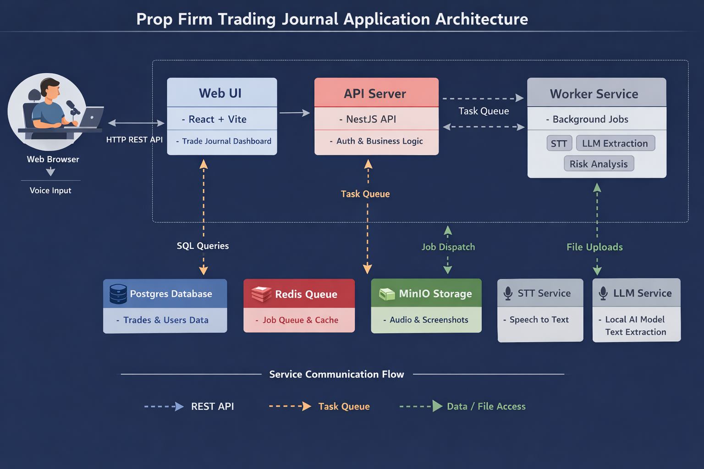

# Prop Firm Trader Journal

Local-first, voice-first trading journal built for prop firm challenge rules, risk monitoring, and fee ROI.  
Web first, later mobile using the same APIs.

## Why this exists
Prop firm traders fail challenges primarily due to rule violations and risk drift. This project focuses on:
- Voice-based trade logging with full trade management lifecycle
- Rule-aware risk matrix (daily, overall, trailing drawdown)
- Purchases, payouts, adjustments, and fee ROI tracking
- Local-first deployment with Docker Compose

## Tech stack (local-first)
- Web: React + Vite
- API: NestJS (REST)
- Worker: Node.js background jobs
- Database: Postgres
- Queue: Redis
- Object storage: MinIO (audio, rules images)
- Optional: Whisper STT, OCR, Local LLM extraction

## Run locally (high level)
This repo is intended to run via Docker Compose.
- Start: docker compose up
- Stop: docker compose down

Exact commands and environment variables will be documented once the compose file is added.

## Project documentation
All project requirements, architecture, and standards live in the repo and are mandatory reading for contributors and reviewers.

### Product requirements
- docs/prd/PRD.md

### Architecture
- docs/architecture/ARCHITECTURE.md
- docs/architecture/SERVICES.md
- docs/architecture/DATA_MODEL.md
- docs/architecture/API.md
- docs/architecture/PIPELINES.md

### Engineering standards
- docs/standards/REVIEW_CHECKLIST.md
- docs/standards/PR_NAMING.md
- docs/standards/CODING_STANDARDS.md

Start here:
- docs/README.md

## Backlog and delivery workflow
- Backlog tracking: GitHub Issues + GitHub Projects
- Each PR must link exactly one issue
- PR title must include the issue reference (#123 or (#123))
- PR description must include "Closes #123"

See:
- docs/standards/PR_NAMING.md

## Definition of done (MVP)
- Create firm, product, ruleset, purchase, and multiple accounts
- Log trades via voice and confirm structured events
- Risk matrix shows daily and overall drawdown remaining per account
- ROI dashboard shows total spend and fee ROI per firm and overall
- Runs locally via Docker with no required paid services

## License
TBD
